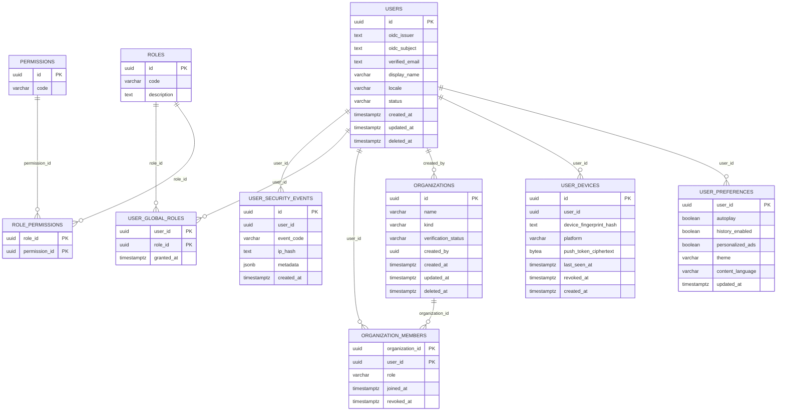

# 0001_identity.up — ER diagram

```mermaid
erDiagram
  ORGANIZATION_MEMBERS {
    uuid organization_id PK
    uuid user_id PK
    varchar role
    timestamptz joined_at
    timestamptz revoked_at
  }
  ORGANIZATIONS {
    uuid id PK
    varchar name
    varchar kind
    varchar verification_status
    uuid created_by
    timestamptz created_at
    timestamptz updated_at
    timestamptz deleted_at
  }
  PERMISSIONS {
    uuid id PK
    varchar code
  }
  ROLE_PERMISSIONS {
    uuid role_id PK
    uuid permission_id PK
  }
  ROLES {
    uuid id PK
    varchar code
    text description
  }
  USER_DEVICES {
    uuid id PK
    uuid user_id
    text device_fingerprint_hash
    varchar platform
    bytea push_token_ciphertext
    timestamptz last_seen_at
    timestamptz revoked_at
    timestamptz created_at
  }
  USER_GLOBAL_ROLES {
    uuid user_id PK
    uuid role_id PK
    timestamptz granted_at
  }
  USER_PREFERENCES {
    uuid user_id PK
    boolean autoplay
    boolean history_enabled
    boolean personalized_ads
    varchar theme
    varchar content_language
    timestamptz updated_at
  }
  USER_SECURITY_EVENTS {
    uuid id PK
    uuid user_id
    varchar event_code
    text ip_hash
    jsonb metadata
    timestamptz created_at
  }
  USERS {
    uuid id PK
    text oidc_issuer
    text oidc_subject
    text verified_email
    varchar display_name
    varchar locale
    varchar status
    timestamptz created_at
    timestamptz updated_at
    timestamptz deleted_at
  }
  USERS ||--o{ USER_PREFERENCES : "user_id"
  USERS ||--o{ USER_DEVICES : "user_id"
  USERS ||--o{ ORGANIZATIONS : "created_by"
  ORGANIZATIONS ||--o{ ORGANIZATION_MEMBERS : "organization_id"
  USERS ||--o{ ORGANIZATION_MEMBERS : "user_id"
  ROLES ||--o{ ROLE_PERMISSIONS : "role_id"
  PERMISSIONS ||--o{ ROLE_PERMISSIONS : "permission_id"
  USERS ||--o{ USER_GLOBAL_ROLES : "user_id"
  ROLES ||--o{ USER_GLOBAL_ROLES : "role_id"
  USERS ||--o{ USER_SECURITY_EVENTS : "user_id"
```
