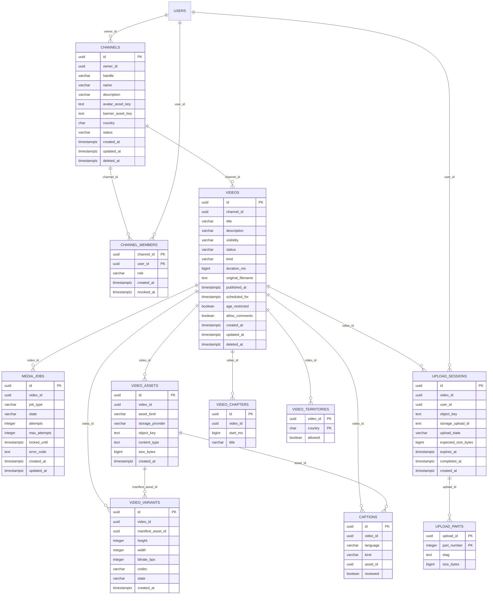

# 0002_catalog.up — ER diagram

```mermaid
erDiagram
  CAPTIONS {
    uuid id PK
    uuid video_id
    varchar language
    varchar kind
    uuid asset_id
    boolean reviewed
  }
  CHANNEL_MEMBERS {
    uuid channel_id PK
    uuid user_id PK
    varchar role
    timestamptz created_at
    timestamptz revoked_at
  }
  CHANNELS {
    uuid id PK
    uuid owner_id
    varchar handle
    varchar name
    varchar description
    text avatar_asset_key
    text banner_asset_key
    char country
    varchar status
    timestamptz created_at
    timestamptz updated_at
    timestamptz deleted_at
  }
  MEDIA_JOBS {
    uuid id PK
    uuid video_id
    varchar job_type
    varchar state
    integer attempts
    integer max_attempts
    timestamptz locked_until
    text error_code
    timestamptz created_at
    timestamptz updated_at
  }
  UPLOAD_PARTS {
    uuid upload_id PK
    integer part_number PK
    text etag
    bigint size_bytes
  }
  UPLOAD_SESSIONS {
    uuid id PK
    uuid video_id
    uuid user_id
    text object_key
    text storage_upload_id
    varchar upload_state
    bigint expected_size_bytes
    timestamptz expires_at
    timestamptz completed_at
    timestamptz created_at
  }
  VIDEO_ASSETS {
    uuid id PK
    uuid video_id
    varchar asset_kind
    varchar storage_provider
    text object_key
    text content_type
    bigint size_bytes
    timestamptz created_at
  }
  VIDEO_CHAPTERS {
    uuid id PK
    uuid video_id
    bigint start_ms
    varchar title
  }
  VIDEO_TERRITORIES {
    uuid video_id PK
    char country PK
    boolean allowed
  }
  VIDEO_VARIANTS {
    uuid id PK
    uuid video_id
    uuid manifest_asset_id
    integer height
    integer width
    integer bitrate_bps
    varchar codec
    varchar state
    timestamptz created_at
  }
  VIDEOS {
    uuid id PK
    uuid channel_id
    varchar title
    varchar description
    varchar visibility
    varchar status
    varchar kind
    bigint duration_ms
    text original_filename
    timestamptz published_at
    timestamptz scheduled_for
    boolean age_restricted
    boolean allow_comments
    timestamptz created_at
    timestamptz updated_at
    timestamptz deleted_at
  }
  USERS ||--o{ CHANNELS : "owner_id"
  CHANNELS ||--o{ CHANNEL_MEMBERS : "channel_id"
  USERS ||--o{ CHANNEL_MEMBERS : "user_id"
  CHANNELS ||--o{ VIDEOS : "channel_id"
  VIDEOS ||--o{ VIDEO_ASSETS : "video_id"
  VIDEOS ||--o{ VIDEO_VARIANTS : "video_id"
  VIDEO_ASSETS ||--o{ VIDEO_VARIANTS : "manifest_asset_id"
  VIDEOS ||--o{ UPLOAD_SESSIONS : "video_id"
  USERS ||--o{ UPLOAD_SESSIONS : "user_id"
  UPLOAD_SESSIONS ||--o{ UPLOAD_PARTS : "upload_id"
  VIDEOS ||--o{ MEDIA_JOBS : "video_id"
  VIDEOS ||--o{ VIDEO_CHAPTERS : "video_id"
  VIDEOS ||--o{ CAPTIONS : "video_id"
  VIDEO_ASSETS ||--o{ CAPTIONS : "asset_id"
  VIDEOS ||--o{ VIDEO_TERRITORIES : "video_id"
```
