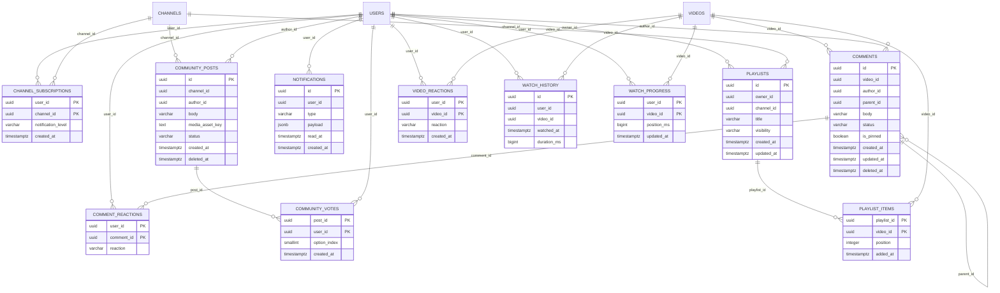

# 0003_social.up — ER diagram

```mermaid
erDiagram
  CHANNEL_SUBSCRIPTIONS {
    uuid user_id PK
    uuid channel_id PK
    varchar notification_level
    timestamptz created_at
  }
  COMMENT_REACTIONS {
    uuid user_id PK
    uuid comment_id PK
    varchar reaction
  }
  COMMENTS {
    uuid id PK
    uuid video_id
    uuid author_id
    uuid parent_id
    varchar body
    varchar status
    boolean is_pinned
    timestamptz created_at
    timestamptz updated_at
    timestamptz deleted_at
  }
  COMMUNITY_POSTS {
    uuid id PK
    uuid channel_id
    uuid author_id
    varchar body
    text media_asset_key
    varchar status
    timestamptz created_at
    timestamptz deleted_at
  }
  COMMUNITY_VOTES {
    uuid post_id PK
    uuid user_id PK
    smallint option_index
    timestamptz created_at
  }
  NOTIFICATIONS {
    uuid id PK
    uuid user_id
    varchar type
    jsonb payload
    timestamptz read_at
    timestamptz created_at
  }
  PLAYLIST_ITEMS {
    uuid playlist_id PK
    uuid video_id PK
    integer position
    timestamptz added_at
  }
  PLAYLISTS {
    uuid id PK
    uuid owner_id
    uuid channel_id
    varchar title
    varchar visibility
    timestamptz created_at
    timestamptz updated_at
  }
  VIDEO_REACTIONS {
    uuid user_id PK
    uuid video_id PK
    varchar reaction
    timestamptz created_at
  }
  WATCH_HISTORY {
    uuid id PK
    uuid user_id
    uuid video_id
    timestamptz watched_at
    bigint duration_ms
  }
  WATCH_PROGRESS {
    uuid user_id PK
    uuid video_id PK
    bigint position_ms
    timestamptz updated_at
  }
  USERS ||--o{ CHANNEL_SUBSCRIPTIONS : "user_id"
  CHANNELS ||--o{ CHANNEL_SUBSCRIPTIONS : "channel_id"
  USERS ||--o{ VIDEO_REACTIONS : "user_id"
  VIDEOS ||--o{ VIDEO_REACTIONS : "video_id"
  VIDEOS ||--o{ COMMENTS : "video_id"
  USERS ||--o{ COMMENTS : "author_id"
  COMMENTS ||--o{ COMMENTS : "parent_id"
  USERS ||--o{ COMMENT_REACTIONS : "user_id"
  COMMENTS ||--o{ COMMENT_REACTIONS : "comment_id"
  USERS ||--o{ PLAYLISTS : "owner_id"
  CHANNELS ||--o{ PLAYLISTS : "channel_id"
  PLAYLISTS ||--o{ PLAYLIST_ITEMS : "playlist_id"
  VIDEOS ||--o{ PLAYLIST_ITEMS : "video_id"
  USERS ||--o{ WATCH_PROGRESS : "user_id"
  VIDEOS ||--o{ WATCH_PROGRESS : "video_id"
  USERS ||--o{ WATCH_HISTORY : "user_id"
  VIDEOS ||--o{ WATCH_HISTORY : "video_id"
  USERS ||--o{ NOTIFICATIONS : "user_id"
  CHANNELS ||--o{ COMMUNITY_POSTS : "channel_id"
  USERS ||--o{ COMMUNITY_POSTS : "author_id"
  COMMUNITY_POSTS ||--o{ COMMUNITY_VOTES : "post_id"
  USERS ||--o{ COMMUNITY_VOTES : "user_id"
```
