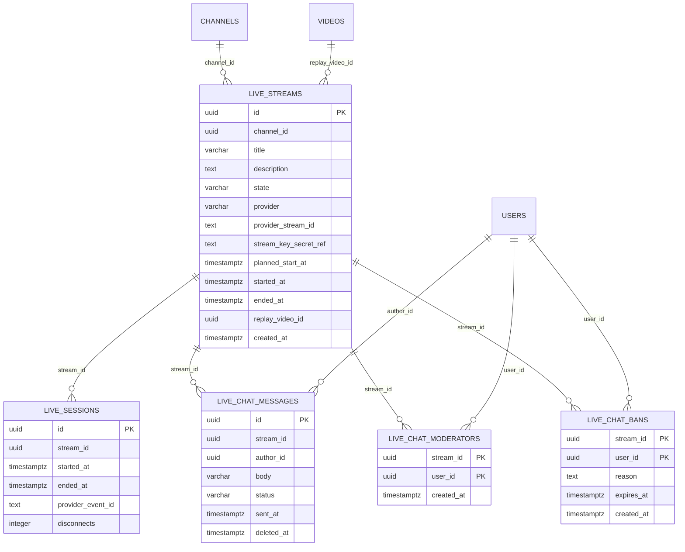

# 0004_live.up — ER diagram

```mermaid
erDiagram
  LIVE_CHAT_BANS {
    uuid stream_id PK
    uuid user_id PK
    text reason
    timestamptz expires_at
    timestamptz created_at
  }
  LIVE_CHAT_MESSAGES {
    uuid id PK
    uuid stream_id
    uuid author_id
    varchar body
    varchar status
    timestamptz sent_at
    timestamptz deleted_at
  }
  LIVE_CHAT_MODERATORS {
    uuid stream_id PK
    uuid user_id PK
    timestamptz created_at
  }
  LIVE_SESSIONS {
    uuid id PK
    uuid stream_id
    timestamptz started_at
    timestamptz ended_at
    text provider_event_id
    integer disconnects
  }
  LIVE_STREAMS {
    uuid id PK
    uuid channel_id
    varchar title
    text description
    varchar state
    varchar provider
    text provider_stream_id
    text stream_key_secret_ref
    timestamptz planned_start_at
    timestamptz started_at
    timestamptz ended_at
    uuid replay_video_id
    timestamptz created_at
  }
  CHANNELS ||--o{ LIVE_STREAMS : "channel_id"
  VIDEOS ||--o{ LIVE_STREAMS : "replay_video_id"
  LIVE_STREAMS ||--o{ LIVE_SESSIONS : "stream_id"
  LIVE_STREAMS ||--o{ LIVE_CHAT_MESSAGES : "stream_id"
  USERS ||--o{ LIVE_CHAT_MESSAGES : "author_id"
  LIVE_STREAMS ||--o{ LIVE_CHAT_MODERATORS : "stream_id"
  USERS ||--o{ LIVE_CHAT_MODERATORS : "user_id"
  LIVE_STREAMS ||--o{ LIVE_CHAT_BANS : "stream_id"
  USERS ||--o{ LIVE_CHAT_BANS : "user_id"
```
