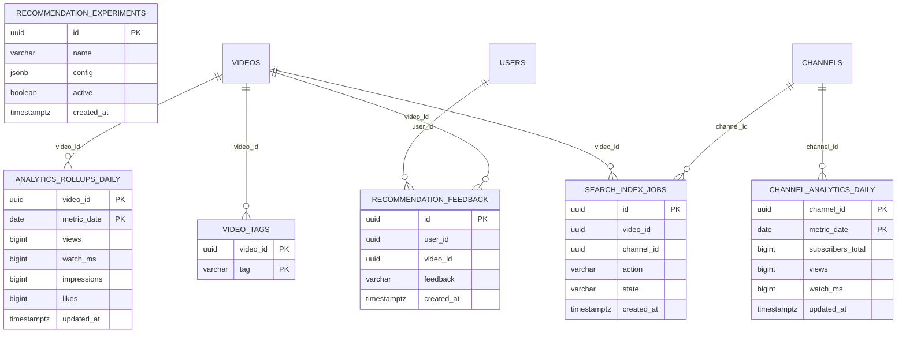

# 0005_analytics.up — ER diagram

```mermaid
erDiagram
  ANALYTICS_ROLLUPS_DAILY {
    uuid video_id PK
    date metric_date PK
    bigint views
    bigint watch_ms
    bigint impressions
    bigint likes
    timestamptz updated_at
  }
  CHANNEL_ANALYTICS_DAILY {
    uuid channel_id PK
    date metric_date PK
    bigint subscribers_total
    bigint views
    bigint watch_ms
    timestamptz updated_at
  }
  RECOMMENDATION_EXPERIMENTS {
    uuid id PK
    varchar name
    jsonb config
    boolean active
    timestamptz created_at
  }
  RECOMMENDATION_FEEDBACK {
    uuid id PK
    uuid user_id
    uuid video_id
    varchar feedback
    timestamptz created_at
  }
  SEARCH_INDEX_JOBS {
    uuid id PK
    uuid video_id
    uuid channel_id
    varchar action
    varchar state
    timestamptz created_at
  }
  VIDEO_TAGS {
    uuid video_id PK
    varchar tag PK
  }
  VIDEOS ||--o{ ANALYTICS_ROLLUPS_DAILY : "video_id"
  CHANNELS ||--o{ CHANNEL_ANALYTICS_DAILY : "channel_id"
  VIDEOS ||--o{ VIDEO_TAGS : "video_id"
  USERS ||--o{ RECOMMENDATION_FEEDBACK : "user_id"
  VIDEOS ||--o{ RECOMMENDATION_FEEDBACK : "video_id"
  VIDEOS ||--o{ SEARCH_INDEX_JOBS : "video_id"
  CHANNELS ||--o{ SEARCH_INDEX_JOBS : "channel_id"
```
