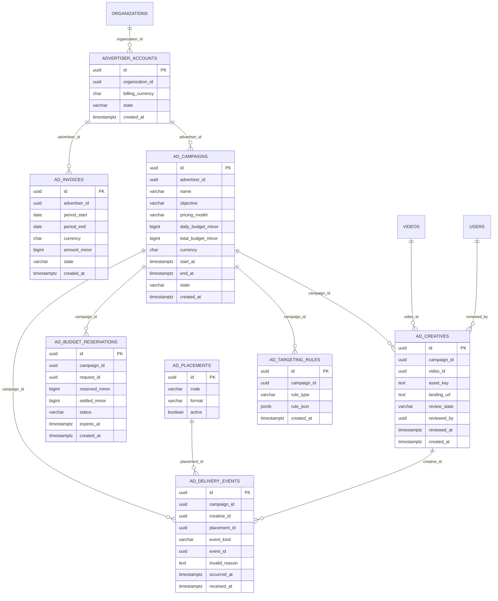

# 0006_advertising.up — ER diagram

```mermaid
erDiagram
  AD_BUDGET_RESERVATIONS {
    uuid id PK
    uuid campaign_id
    uuid request_id
    bigint reserved_minor
    bigint settled_minor
    varchar status
    timestamptz expires_at
    timestamptz created_at
  }
  AD_CAMPAIGNS {
    uuid id PK
    uuid advertiser_id
    varchar name
    varchar objective
    varchar pricing_model
    bigint daily_budget_minor
    bigint total_budget_minor
    char currency
    timestamptz start_at
    timestamptz end_at
    varchar state
    timestamptz created_at
  }
  AD_CREATIVES {
    uuid id PK
    uuid campaign_id
    uuid video_id
    text asset_key
    text landing_url
    varchar review_state
    uuid reviewed_by
    timestamptz reviewed_at
    timestamptz created_at
  }
  AD_DELIVERY_EVENTS {
    uuid id PK
    uuid campaign_id
    uuid creative_id
    uuid placement_id
    varchar event_kind
    uuid event_id
    text invalid_reason
    timestamptz occurred_at
    timestamptz received_at
  }
  AD_INVOICES {
    uuid id PK
    uuid advertiser_id
    date period_start
    date period_end
    char currency
    bigint amount_minor
    varchar state
    timestamptz created_at
  }
  AD_PLACEMENTS {
    uuid id PK
    varchar code
    varchar format
    boolean active
  }
  AD_TARGETING_RULES {
    uuid id PK
    uuid campaign_id
    varchar rule_type
    jsonb rule_json
    timestamptz created_at
  }
  ADVERTISER_ACCOUNTS {
    uuid id PK
    uuid organization_id
    char billing_currency
    varchar state
    timestamptz created_at
  }
  ORGANIZATIONS ||--o{ ADVERTISER_ACCOUNTS : "organization_id"
  ADVERTISER_ACCOUNTS ||--o{ AD_CAMPAIGNS : "advertiser_id"
  AD_CAMPAIGNS ||--o{ AD_CREATIVES : "campaign_id"
  VIDEOS ||--o{ AD_CREATIVES : "video_id"
  USERS ||--o{ AD_CREATIVES : "reviewed_by"
  AD_CAMPAIGNS ||--o{ AD_TARGETING_RULES : "campaign_id"
  AD_CAMPAIGNS ||--o{ AD_BUDGET_RESERVATIONS : "campaign_id"
  AD_CAMPAIGNS ||--o{ AD_DELIVERY_EVENTS : "campaign_id"
  AD_CREATIVES ||--o{ AD_DELIVERY_EVENTS : "creative_id"
  AD_PLACEMENTS ||--o{ AD_DELIVERY_EVENTS : "placement_id"
  ADVERTISER_ACCOUNTS ||--o{ AD_INVOICES : "advertiser_id"
```
