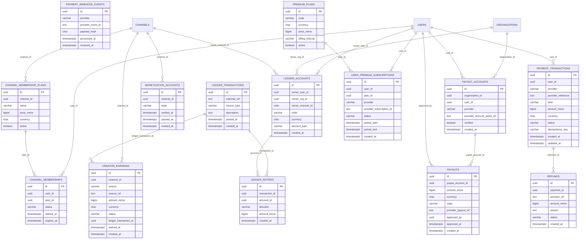

# 0007_monetization.up — ER diagram

```mermaid
erDiagram
  CHANNEL_MEMBERSHIP_PLANS {
    uuid id PK
    uuid channel_id
    varchar name
    bigint price_minor
    char currency
    boolean active
  }
  CHANNEL_MEMBERSHIPS {
    uuid id PK
    uuid user_id
    uuid plan_id
    varchar status
    timestamptz started_at
    timestamptz expires_at
  }
  CREATOR_EARNINGS {
    uuid id PK
    uuid channel_id
    varchar source
    text source_ref
    bigint amount_minor
    char currency
    varchar status
    uuid ledger_transaction_id
    timestamptz earned_at
    timestamptz created_at
  }
  LEDGER_ACCOUNTS {
    uuid id PK
    uuid owner_user_id
    uuid owner_org_id
    uuid owner_channel_id
    varchar code
    char currency
    varchar account_type
    timestamptz created_at
  }
  LEDGER_ENTRIES {
    uuid id PK
    uuid transaction_id
    uuid account_id
    varchar direction
    bigint amount_minor
    timestamptz created_at
  }
  LEDGER_TRANSACTIONS {
    uuid id PK
    text external_ref
    varchar source_type
    text description
    timestamptz posted_at
    timestamptz created_at
  }
  MONETIZATION_ACCOUNTS {
    uuid id PK
    uuid channel_id
    varchar state
    timestamptz verified_at
    timestamptz paused_at
    timestamptz created_at
  }
  PAYMENT_TRANSACTIONS {
    uuid id PK
    uuid user_id
    varchar provider
    text provider_reference
    varchar kind
    bigint amount_minor
    char currency
    varchar status
    varchar idempotency_key
    timestamptz created_at
    timestamptz updated_at
  }
  PAYMENT_WEBHOOK_EVENTS {
    uuid id PK
    varchar provider
    text provider_event_id
    char payload_hash
    timestamptz processed_at
    timestamptz received_at
  }
  PAYOUT_ACCOUNTS {
    uuid id PK
    uuid organization_id
    uuid user_id
    varchar provider
    text provider_account_token_ref
    boolean verified
    timestamptz created_at
  }
  PAYOUTS {
    uuid id PK
    uuid payee_account_id
    bigint amount_minor
    char currency
    varchar state
    text provider_payout_ref
    uuid approved_by
    timestamptz approved_at
    timestamptz created_at
  }
  PREMIUM_PLANS {
    uuid id PK
    varchar code
    char currency
    bigint price_minor
    varchar billing_interval
    boolean active
  }
  REFUNDS {
    uuid id PK
    uuid payment_id
    text provider_ref
    bigint amount_minor
    text reason
    varchar status
    timestamptz created_at
  }
  USER_PREMIUM_SUBSCRIPTIONS {
    uuid id PK
    uuid user_id
    uuid plan_id
    varchar provider
    text provider_subscription_id
    varchar status
    timestamptz period_start
    timestamptz period_end
    timestamptz created_at
  }
  CHANNELS ||--o{ MONETIZATION_ACCOUNTS : "channel_id"
  USERS ||--o{ USER_PREMIUM_SUBSCRIPTIONS : "user_id"
  PREMIUM_PLANS ||--o{ USER_PREMIUM_SUBSCRIPTIONS : "plan_id"
  CHANNELS ||--o{ CHANNEL_MEMBERSHIP_PLANS : "channel_id"
  USERS ||--o{ CHANNEL_MEMBERSHIPS : "user_id"
  CHANNEL_MEMBERSHIP_PLANS ||--o{ CHANNEL_MEMBERSHIPS : "plan_id"
  USERS ||--o{ PAYMENT_TRANSACTIONS : "user_id"
  PAYMENT_TRANSACTIONS ||--o{ REFUNDS : "payment_id"
  USERS ||--o{ LEDGER_ACCOUNTS : "owner_user_id"
  ORGANIZATIONS ||--o{ LEDGER_ACCOUNTS : "owner_org_id"
  CHANNELS ||--o{ LEDGER_ACCOUNTS : "owner_channel_id"
  LEDGER_TRANSACTIONS ||--o{ LEDGER_ENTRIES : "transaction_id"
  LEDGER_ACCOUNTS ||--o{ LEDGER_ENTRIES : "account_id"
  CHANNELS ||--o{ CREATOR_EARNINGS : "channel_id"
  LEDGER_TRANSACTIONS ||--o{ CREATOR_EARNINGS : "ledger_transaction_id"
  ORGANIZATIONS ||--o{ PAYOUT_ACCOUNTS : "organization_id"
  USERS ||--o{ PAYOUT_ACCOUNTS : "user_id"
  PAYOUT_ACCOUNTS ||--o{ PAYOUTS : "payee_account_id"
  USERS ||--o{ PAYOUTS : "approved_by"
```
