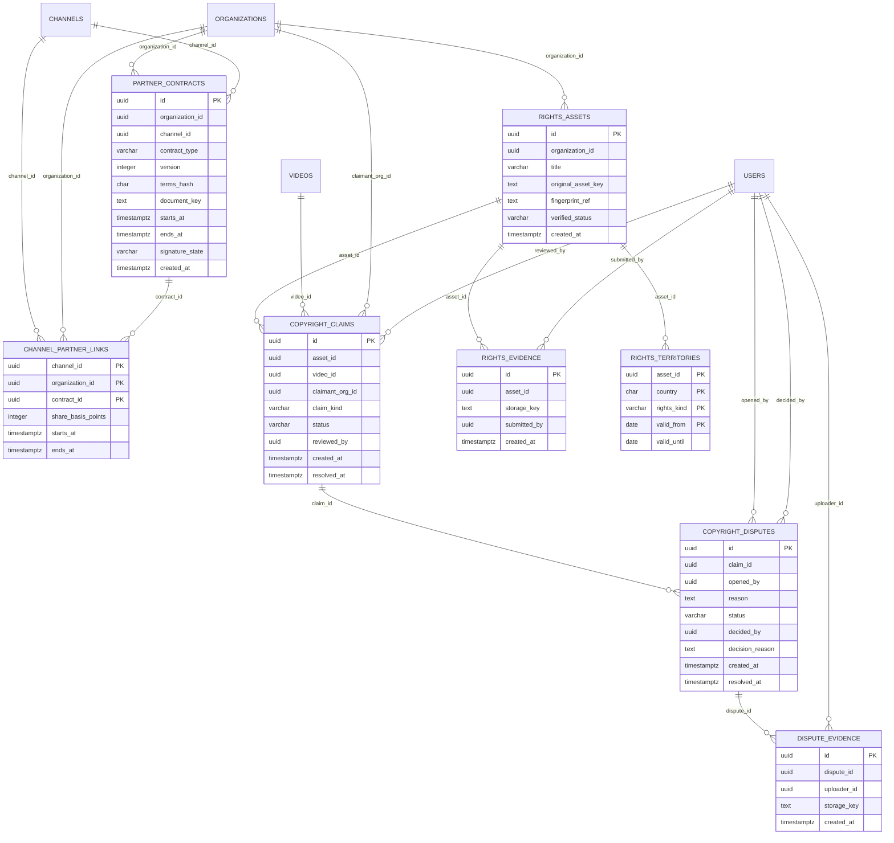

# 0008_partner_rights.up — ER diagram

```mermaid
erDiagram
  CHANNEL_PARTNER_LINKS {
    uuid channel_id PK
    uuid organization_id PK
    uuid contract_id PK
    integer share_basis_points
    timestamptz starts_at
    timestamptz ends_at
  }
  COPYRIGHT_CLAIMS {
    uuid id PK
    uuid asset_id
    uuid video_id
    uuid claimant_org_id
    varchar claim_kind
    varchar status
    uuid reviewed_by
    timestamptz created_at
    timestamptz resolved_at
  }
  COPYRIGHT_DISPUTES {
    uuid id PK
    uuid claim_id
    uuid opened_by
    text reason
    varchar status
    uuid decided_by
    text decision_reason
    timestamptz created_at
    timestamptz resolved_at
  }
  DISPUTE_EVIDENCE {
    uuid id PK
    uuid dispute_id
    uuid uploader_id
    text storage_key
    timestamptz created_at
  }
  PARTNER_CONTRACTS {
    uuid id PK
    uuid organization_id
    uuid channel_id
    varchar contract_type
    integer version
    char terms_hash
    text document_key
    timestamptz starts_at
    timestamptz ends_at
    varchar signature_state
    timestamptz created_at
  }
  RIGHTS_ASSETS {
    uuid id PK
    uuid organization_id
    varchar title
    text original_asset_key
    text fingerprint_ref
    varchar verified_status
    timestamptz created_at
  }
  RIGHTS_EVIDENCE {
    uuid id PK
    uuid asset_id
    text storage_key
    uuid submitted_by
    timestamptz created_at
  }
  RIGHTS_TERRITORIES {
    uuid asset_id PK
    char country PK
    varchar rights_kind PK
    date valid_from PK
    date valid_until
  }
  ORGANIZATIONS ||--o{ PARTNER_CONTRACTS : "organization_id"
  CHANNELS ||--o{ PARTNER_CONTRACTS : "channel_id"
  CHANNELS ||--o{ CHANNEL_PARTNER_LINKS : "channel_id"
  ORGANIZATIONS ||--o{ CHANNEL_PARTNER_LINKS : "organization_id"
  PARTNER_CONTRACTS ||--o{ CHANNEL_PARTNER_LINKS : "contract_id"
  ORGANIZATIONS ||--o{ RIGHTS_ASSETS : "organization_id"
  RIGHTS_ASSETS ||--o{ RIGHTS_TERRITORIES : "asset_id"
  RIGHTS_ASSETS ||--o{ RIGHTS_EVIDENCE : "asset_id"
  USERS ||--o{ RIGHTS_EVIDENCE : "submitted_by"
  RIGHTS_ASSETS ||--o{ COPYRIGHT_CLAIMS : "asset_id"
  VIDEOS ||--o{ COPYRIGHT_CLAIMS : "video_id"
  ORGANIZATIONS ||--o{ COPYRIGHT_CLAIMS : "claimant_org_id"
  USERS ||--o{ COPYRIGHT_CLAIMS : "reviewed_by"
  COPYRIGHT_CLAIMS ||--o{ COPYRIGHT_DISPUTES : "claim_id"
  USERS ||--o{ COPYRIGHT_DISPUTES : "opened_by"
  USERS ||--o{ COPYRIGHT_DISPUTES : "decided_by"
  COPYRIGHT_DISPUTES ||--o{ DISPUTE_EVIDENCE : "dispute_id"
  USERS ||--o{ DISPUTE_EVIDENCE : "uploader_id"
```
