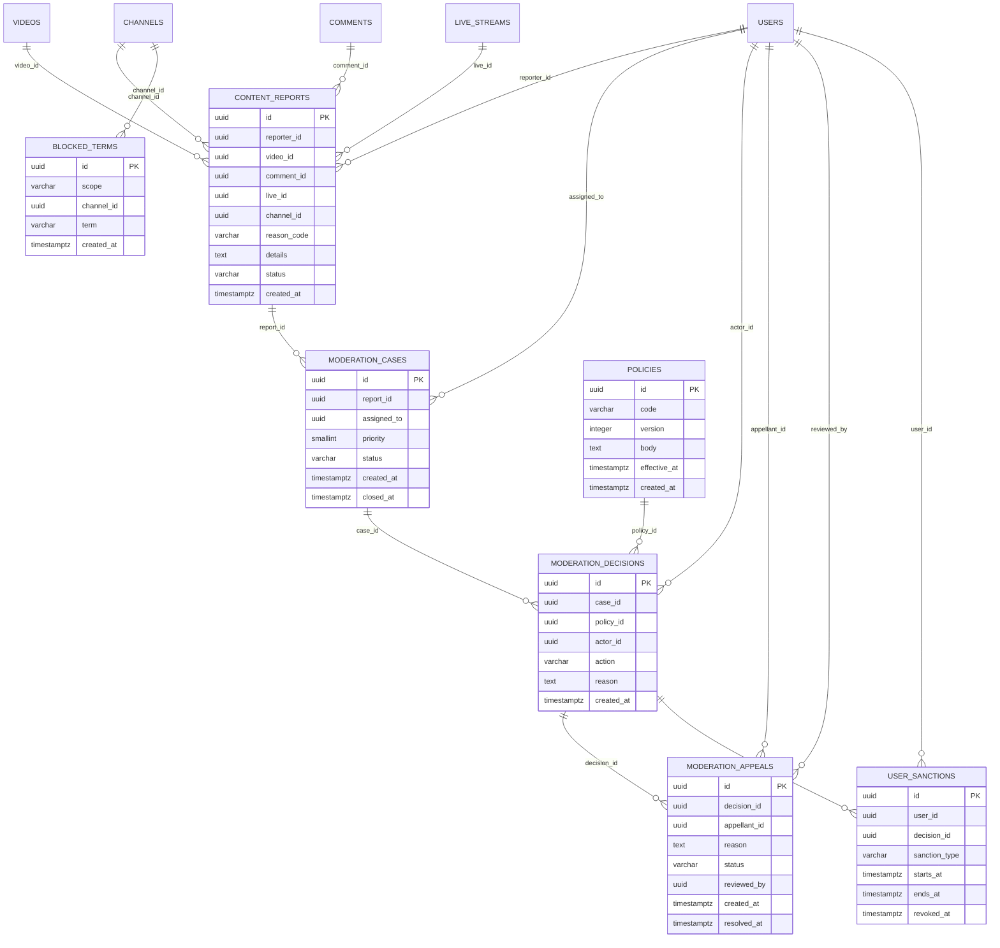

# 0009_moderation.up — ER diagram

```mermaid
erDiagram
  BLOCKED_TERMS {
    uuid id PK
    varchar scope
    uuid channel_id
    varchar term
    timestamptz created_at
  }
  CONTENT_REPORTS {
    uuid id PK
    uuid reporter_id
    uuid video_id
    uuid comment_id
    uuid live_id
    uuid channel_id
    varchar reason_code
    text details
    varchar status
    timestamptz created_at
  }
  MODERATION_APPEALS {
    uuid id PK
    uuid decision_id
    uuid appellant_id
    text reason
    varchar status
    uuid reviewed_by
    timestamptz created_at
    timestamptz resolved_at
  }
  MODERATION_CASES {
    uuid id PK
    uuid report_id
    uuid assigned_to
    smallint priority
    varchar status
    timestamptz created_at
    timestamptz closed_at
  }
  MODERATION_DECISIONS {
    uuid id PK
    uuid case_id
    uuid policy_id
    uuid actor_id
    varchar action
    text reason
    timestamptz created_at
  }
  POLICIES {
    uuid id PK
    varchar code
    integer version
    text body
    timestamptz effective_at
    timestamptz created_at
  }
  USER_SANCTIONS {
    uuid id PK
    uuid user_id
    uuid decision_id
    varchar sanction_type
    timestamptz starts_at
    timestamptz ends_at
    timestamptz revoked_at
  }
  USERS ||--o{ CONTENT_REPORTS : "reporter_id"
  VIDEOS ||--o{ CONTENT_REPORTS : "video_id"
  COMMENTS ||--o{ CONTENT_REPORTS : "comment_id"
  LIVE_STREAMS ||--o{ CONTENT_REPORTS : "live_id"
  CHANNELS ||--o{ CONTENT_REPORTS : "channel_id"
  CONTENT_REPORTS ||--o{ MODERATION_CASES : "report_id"
  USERS ||--o{ MODERATION_CASES : "assigned_to"
  MODERATION_CASES ||--o{ MODERATION_DECISIONS : "case_id"
  POLICIES ||--o{ MODERATION_DECISIONS : "policy_id"
  USERS ||--o{ MODERATION_DECISIONS : "actor_id"
  MODERATION_DECISIONS ||--o{ MODERATION_APPEALS : "decision_id"
  USERS ||--o{ MODERATION_APPEALS : "appellant_id"
  USERS ||--o{ MODERATION_APPEALS : "reviewed_by"
  USERS ||--o{ USER_SANCTIONS : "user_id"
  MODERATION_DECISIONS ||--o{ USER_SANCTIONS : "decision_id"
  CHANNELS ||--o{ BLOCKED_TERMS : "channel_id"
```
