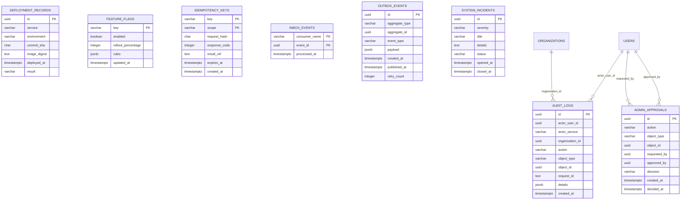

# 0010_operations.up — ER diagram

```mermaid
erDiagram
  ADMIN_APPROVALS {
    uuid id PK
    varchar action
    varchar object_type
    uuid object_id
    uuid requested_by
    uuid approved_by
    varchar decision
    timestamptz created_at
    timestamptz decided_at
  }
  AUDIT_LOGS {
    uuid id PK
    uuid actor_user_id
    varchar actor_service
    uuid organization_id
    varchar action
    varchar object_type
    uuid object_id
    text request_id
    jsonb details
    timestamptz created_at
  }
  DEPLOYMENT_RECORDS {
    uuid id PK
    varchar service
    varchar environment
    char commit_sha
    text image_digest
    timestamptz deployed_at
    varchar result
  }
  FEATURE_FLAGS {
    varchar key PK
    boolean enabled
    integer rollout_percentage
    jsonb rules
    timestamptz updated_at
  }
  IDEMPOTENCY_KEYS {
    varchar key PK
    varchar scope PK
    char request_hash
    integer response_code
    text result_ref
    timestamptz expires_at
    timestamptz created_at
  }
  INBOX_EVENTS {
    varchar consumer_name PK
    uuid event_id PK
    timestamptz processed_at
  }
  OUTBOX_EVENTS {
    uuid id PK
    varchar aggregate_type
    uuid aggregate_id
    varchar event_type
    jsonb payload
    timestamptz created_at
    timestamptz published_at
    integer retry_count
  }
  SYSTEM_INCIDENTS {
    uuid id PK
    varchar severity
    varchar title
    text details
    varchar status
    timestamptz opened_at
    timestamptz closed_at
  }
  USERS ||--o{ AUDIT_LOGS : "actor_user_id"
  ORGANIZATIONS ||--o{ AUDIT_LOGS : "organization_id"
  USERS ||--o{ ADMIN_APPROVALS : "requested_by"
  USERS ||--o{ ADMIN_APPROVALS : "approved_by"
```
